# Greenlight — Architecture Specification
**Google Cloud Agentic Cinema Hackathon**

---

## 1. Executive Summary & System Philosophy

**Greenlight** is an autonomous production-intelligence agent designed for filmmakers, line producers, and 1st Assistant Directors. In traditional film production, breaking down a screenplay and cross-referencing real-world logistics (permits, weather windows, drone regulations, child actor laws, hazardous materials, and remote location access) takes weeks of manual work. 

Greenlight replaces guesswork with an **agentic loop** powered by:
1. **Google ADK (`google-adk`)**: Orchestrates the multi-phase analysis, session management, and tool routing.
2. **Gemini on Google Cloud Vertex AI**: Understands screenplays natively via multimodal input (`gemini-2.5-flash`), extracts production dependencies, determines research requirements, and reasons over external evidence.
3. **Parallel Search API (`https://api.parallel.ai/v1/search`)**: Dynamically queried at runtime by the ADK agent to retrieve verified, real-world regulatory, geographic, safety, and logistical intelligence.
4. **Three-Tier Risk Classifier**: Categorizes every dependency into 🟢 **GREEN** (Low concern / routine), 🟡 **YELLOW** (Review required / conditional friction), or 🔴 **RED** (Significant production hazard / blocker).

```
   ┌────────────────────────────────────────────────────────┐
   │                     Screenplay PDF                     │
   └───────────────────────────┬────────────────────────────┘
                               │
                               ▼
 ┌────────────────────────────────────────────────────────────┐
 │              Google ADK Agent (FastAPI Backend)            │
 │                                                            │
 │  ┌──────────────────────────────────────────────────────┐  │
 │  │      1. Script Breakdown & Entity Extraction         │  │
 │  │         (Vertex AI / Gemini 2.5 Flash)               │  │
 │  └──────────────────────────┬───────────────────────────┘  │
 │                             ▼                              │
 │  ┌──────────────────────────────────────────────────────┐  │
 │  │      2. Research Need Triage                         │  │
 │  │         (Identify permits, risks, weather, laws)     │  │
 │  └──────────────────────────┬───────────────────────────┘  │
 │                             ▼                              │
 │  ┌──────────────────────────────────────────────────────┐  │
 │  │      3. ADK FunctionTool: parallel_search_tool       │──┼──┐
 │  └──────────────────────────────────────────────────────┘  │  │
 │                             ▲                              │  │
 │                             │ Evidence Passages + URLs     │  │
 │  ┌──────────────────────────┴───────────────────────────┐  │  │
 │  │      4. Evidence-Backed Risk Synthesis (🟢 🟡 🔴)     │  │  │
 │  │         (Gemini Reasoning + Grounded Proof)          │  │  │
 │  └──────────────────────────┬───────────────────────────┘  │  │
 └─────────────────────────────┼──────────────────────────────┘  │
                               │                                 │
                               ▼                                 │ Runtime API
             ┌───────────────────────────────────┐               │ Call
             │    Greenlight Production Brief    │               ▼
             │ (Executive Summary, Risks, Proof) │    ┌──────────────────────┐
             └───────────────────────────────────┘    │ Parallel Search API  │
                                                      │ (api.parallel.ai/v1) │
                                                      └──────────────────────┘
```

---

## 2. Technology Stack & Environment Alignment

Greenlight runs entirely within the pre-configured workspace virtual environment (`.venv`) with zero extra heavyweight infrastructure:

| Component | Technology | Version / Spec | Purpose |
|---|---|---|---|
| **Agent Framework** | `google-adk` | `1.14.1` | Agent lifecycle, tool wrapping, runner, event pipeline |
| **Foundation Model** | `gemini-2.5-flash` | Google Cloud Vertex AI | Multimodal script parsing, extraction, synthesis |
| **GCP Backend** | Vertex AI (`aiplatform.googleapis.com`) | Project: `greenlight-ac-2026-lkr`, Location: `us-central1` | Enterprise LLM inference with Application Default Credentials (ADC) |
| **Web Research** | Parallel Search API | `https://api.parallel.ai/v1/search` | Runtime web search with LLM-optimized excerpts and URLs |
| **API Server** | `fastapi` & `uvicorn` | `0.141.1` / `0.52.4` | Lightweight REST & Server-Sent Events (SSE) server |
| **Data Schemas** | `pydantic` | `2.13.5` | Strict schema validation for production entities and brief |
| **Client / UI** | HTML5 + Vanilla CSS + ES6 JS | Zero build step | Dark cinematic dashboard, real-time agent thought feed |

---

## 3. Project Directory Structure

The project avoids unnecessary microservices or external databases, structuring code into modular, demonstrable components:

```
c:\Projects\greenlight\
├── ARCHITECTURE.md                  # System architecture & runtime design (this file)
├── PRODUCT_SPEC.md                  # Product specifications, user journeys & screens
├── .env.example                     # Environment template (Vertex AI config + Parallel API key)
├── greenlight_agent\                # Existing ADK verification agent (untouched)
│   ├── .env
│   ├── __init__.py
│   ├── agent.py
│   └── verify_agent.py
├── server\                          # Application core
│   ├── __init__.py
│   ├── main.py                      # FastAPI application entrypoint & static mounting
│   ├── config.py                    # Environment settings (Pydantic Settings / os.environ)
│   ├── models\                      # Data schemas
│   │   ├── __init__.py
│   │   ├── screenplay.py            # Scene, Character, Prop, Location entities
│   │   ├── research.py              # Parallel search queries and results
│   │   └── brief.py                 # Final Greenlight Production Brief schema
│   ├── agent\                       # ADK Agent orchestration
│   │   ├── __init__.py
│   │   ├── greenlight_agent.py      # ADK Agent definition, instructions, tool binding
│   │   ├── prompts.py               # Extraction, triage, and synthesis prompt templates
│   │   └── tools\
│   │       ├── __init__.py
│   │       └── parallel_search.py   # ADK FunctionTool calling Parallel Search API
│   ├── services\                    # Supporting business logic
│   │   ├── __init__.py
│   │   ├── script_parser.py         # Multi-format screenplay ingestion (.pdf, .fountain, .txt)
│   │   └── sample_library.py        # Curated demo scenes for immediate 1-click judging
│   └── static\                      # Cinematic web UI (HTML, CSS, JS)
│       ├── index.html               # Single Page Application
│       ├── css\
│       │   └── style.css            # Dark cinematic design system & glassmorphism
│       └── js\
│           ├── app.js               # Frontend UI controller & state management
│           └── api.js               # API client & SSE agent thought streamer
└── tests\                           # Test suite
    ├── __init__.py
    ├── test_parallel_tool.py        # Parallel search API unit & mock test
    ├── test_script_parser.py        # Screenplay parser tests
    └── test_agent_workflow.py       # End-to-end agent workflow verification
```

---

## 4. Agent Architecture & Multi-Phase Workflow

The Greenlight ADK agent operates in three distinct, sequential phases orchestrated through an in-memory session:

### Phase 1: Script Parsing & Production Entity Extraction
- **Input**: Raw screenplay text or PDF document.
- **Model Role**: Vertex AI Gemini (`gemini-2.5-flash`).
- **Operation**: Gemini inspects the scene headings (Sluglines: `INT./EXT.`, `LOCATION`, `DAY/NIGHT`), dialogue, and action lines to extract:
  - **Locations**: Setting, interior vs. exterior, geographic clues.
  - **Characters & Cast**: Speaking characters, background extras, minor/child actors.
  - **Physical Production Elements**: Vehicles, specialized props, period wardrobe, weapons, stunts, pyrotechnics.
  - **Environmental Elements**: Rain, snow, fog, darkness, golden hour requirements.
  - **Initial Risk Indicators**: Implicit logistical bottlenecks.

### Phase 2: Autonomous Research Need Triage
- The agent reviews the extracted entities and determines which dependencies require real-world verification rather than general LLM speculation.
- Examples of flagged questions:
  - *Location: "Can a drone swarm film over Lower Manhattan at 2 AM without street closures?"*
  - *Pyrotechnics: "What are the fire department permitting lead times for high explosives in Atlanta, GA?"*
  - *Cast/Safety: "Are there union restrictions or stunt coordinator mandates for open water night scenes?"*
  - *Environment: "What is the historical freeze window for Lake Winnipeg filming in November?"*
- For each flagged requirement, the agent formulates a focused **Objective** and high-precision **Search Queries**.

### Phase 3: Runtime Parallel Search API Invocation
- The agent calls its registered ADK tool: `parallel_search_tool`.
- The tool performs a runtime `POST` request to `https://api.parallel.ai/v1/search`.
- Headers:
  - `Content-Type: application/json`
  - `x-api-key: <PARALLEL_API_KEY>`
- Payload:
  ```json
  {
    "objective": "Verify drone flight permit lead times and night flight restrictions in New York City FAA jurisdiction",
    "search_queries": [
      "NYC Mayor Office of Media and Entertainment drone permit timeline",
      "FAA Part 107 night flight filming regulations New York City"
    ]
  }
  ```
- Parallel returns LLM-optimized excerpts, titles, publication dates, and source URLs.

### Phase 4: Evidence-Grounded Synthesis & Risk Classification
- The agent ingests the Parallel excerpts and evaluates the real-world constraints against the screenplay demands.
- Each finding is assigned an evidence-backed rating:
  - 🟢 **GREEN (Low Concern)**: Standard local permitting, easily sourced equipment, minimal risk.
  - 🟡 **YELLOW (Review Required)**: Requires 30+ day permit lead time, specialized safety crew, or seasonal weather contingency.
  - 🔴 **RED (Critical Hazard / Blocker)**: Legal prohibition, hazardous uninsurable stunts, conflicting seasonal conditions, or extreme cost drivers.
- **Output**: The complete "Greenlight Production Brief" with direct citations.

---

## 5. Exact Runtime Interaction Sequence

```mermaid
sequenceDiagram
    autonumber
    actor Filmmaker as Filmmaker / Judge
    participant UI as Greenlight Web UI
    participant Server as FastAPI Server
    participant ADK as Google ADK Runner
    participant Gemini as Vertex AI Gemini 2.5
    participant Parallel as Parallel Search API

    Filmmaker->>UI: Upload Screenplay (or select Demo Scene)
    UI->>Server: POST /api/analyze (screenplay file / text)
    Server->>ADK: Initialize InMemorySession & start run_async()
    
    rect rgb(30, 41, 59)
        note right of ADK: Phase 1: Script Analysis
        ADK->>Gemini: Parse script & extract production entities
        Gemini-->>ADK: Structured Scene & Dependency Breakdown
        ADK-->>Server: Yield ScriptBreakdownEvent
        Server-->>UI: Stream breakdown progress
    end

    rect rgb(15, 23, 42)
        note right of ADK: Phase 2 & 3: Parallel Tool Invocation
        ADK->>Gemini: Identify external dependencies needing verification
        Gemini-->>ADK: Call Tool: parallel_search_tool(objective, queries)
        ADK->>Parallel: POST https://api.parallel.ai/v1/search
        Parallel-->>ADK: {search_id, results: [{url, title, excerpts}]}
        ADK-->>Server: Yield ToolExecutionEvent (Queries + Sources)
        Server-->>UI: Stream Parallel Search citations live
    end

    rect rgb(30, 41, 59)
        note right of ADK: Phase 4: Risk Scoring & Brief Synthesis
        ADK->>Gemini: Ground findings with Parallel evidence & score risks (🟢 🟡 🔴)
        Gemini-->>ADK: Final Greenlight Production Brief
        ADK-->>Server: Yield FinalBriefEvent
    end

    Server-->>UI: Complete JSON payload with Executive Summary & Heatmap
    UI-->>Filmmaker: Render interactive Greenlight Production Brief
```



---

## 6. Python Modules & Tools Specification

### 6.1 Parallel Search ADK Tool (`server/agent/tools/parallel_search.py`)
```python
"""Parallel Search API tool for Google ADK."""
import os
import httpx
from typing import List, Dict, Any

PARALLEL_API_URL = "https://api.parallel.ai/v1/search"

async def parallel_search(objective: str, search_queries: List[str]) -> Dict[str, Any]:
    """Searches the live web using Parallel's high-density Search API.
    
    Args:
        objective: The core investigative goal of this search.
        search_queries: High-precision search query strings.
        
    Returns:
        Dictionary containing search_id, results with titles, urls, and excerpts.
    """
    api_key = os.getenv("PARALLEL_API_KEY")
    if not api_key:
        return {
            "error": "PARALLEL_API_KEY environment variable not configured",
            "results": []
        }
    
    headers = {
        "Content-Type": "application/json",
        "x-api-key": api_key,
    }
    payload = {
        "objective": objective,
        "search_queries": search_queries[:3]  # targeted top 3 queries
    }
    
    async with httpx.AsyncClient(timeout=30.0) as client:
        response = await client.post(PARALLEL_API_URL, json=payload, headers=headers)
        response.raise_for_status()
        return response.json()
```

### 6.2 ADK Agent Factory (`server/agent/greenlight_agent.py`)
```python
"""ADK Agent initialization and tool binding."""
from google.adk.agents.llm_agent import Agent
from server.agent.tools.parallel_search import parallel_search
from server.agent.prompts import SYSTEM_INSTRUCTION

def create_greenlight_agent(model_name: str = "gemini-2.5-flash") -> Agent:
    return Agent(
        name="greenlight_production_agent",
        model=model_name,
        description="Autonomous cinema production intelligence agent with Parallel web research.",
        instruction=SYSTEM_INSTRUCTION,
        tools=[parallel_search],
    )
```

---

## 7. Security, Credentials & Secret Management

- **Google Cloud / Vertex AI**:
  - Authenticates via **Application Default Credentials (ADC)**.
  - Zero Google API keys stored in code or repository.
  - Targets project `greenlight-ac-2026-lkr` and region `us-central1`.
- **Parallel Search API**:
  - Authenticates via `PARALLEL_API_KEY` loaded from `.env` or system environment.
  - Never checked into version control.
  - Graceful degradation: If `PARALLEL_API_KEY` is absent during an offline run, the tool returns a mock/cached response for continuous demonstration without crashing.

---

## 8. Hackathon Demonstration Strategy

1. **One-Click Demo Scenes**:
   - Judges do not need to download or format screenplays. The UI includes 3 preloaded high-concept sample scenes:
     - *Scene A: "Midnight Drone Chase over Brooklyn Bridge"* (Tests FAA drone laws & NYC night permits).
     - *Scene B: "Glacier Stunt Crash in Svalbard"* (Tests Arctic logistics, ice season windows, safety evacuation).
     - *Scene C: "Vintage Pyrotechnic Shootout in Historic Savannah Square"* (Tests historic preservation ordinances and fire marshal protocols).
2. **Real-Time Agent Activity Terminal**:
   - The UI displays an active "Agent Telemetry & Thought Log" showing every step:
     - Script ingestion & parsing.
     - Formulated Parallel research objective.
     - Live Parallel queries and received URL citations.
     - Gemini evidence assessment and risk grading.
3. **Downloadable / Printable Production Brief**:
   - Filmmakers can print or export the generated brief directly as a clean PDF/Markdown report.
